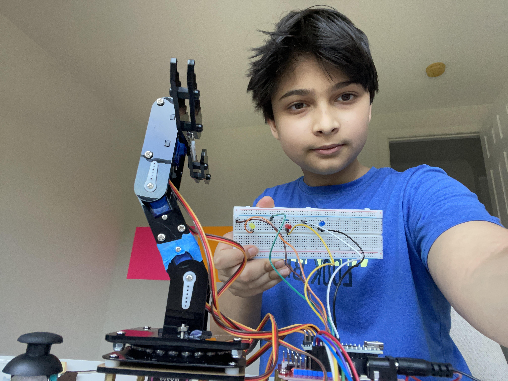

# 3 Joint Robotic Arm
My BSE project was a 3 joint robotic arm. It has a claw and 3 joint to move in 3 axes and pick things up. It moves using servos. It can be controlled with a controll as well. All of these components are wired into the nanoshield, which is connected to the Arduino Nano. This is the core of the project and tells everything what to do.

| **Engineer** | **School** | **Area of Interest** | **Grade** |
|:--:|:--:|:--:|:--:|
| Sohum B | Wissahickon Middle School | Mechanical Engineering | Rising 8th Grader


  
# Final Milestone
<iframe width="560" height="315" src="https://www.youtube.com/embed/ope69Nm4aF4?si=EBcXRgTeXzLmC3Pd" title="YouTube video player" frameborder="0" allow="accelerometer; autoplay; clipboard-write; encrypted-media; gyroscope; picture-in-picture; web-share" referrerpolicy="strict-origin-when-cross-origin" allowfullscreen></iframe>
For my final milestone, I decided to change my modification. I was originally going to add Bluetooth to the robot, but due to some issues with the parts, I decided to change that. I ended up going with an LED modification. Whenever I move the left stick up, the yellow LED turns on. When I move the left stick to the right, the red LED turns on. And finally, whenever I move the right stick up, the blue LED turns on. I simply turn them the opposite direction to turn them off. My biggest triumph was defintely getting the code to work somewhat Now, I mostly have control over the robot as compared to before when I didn't. Also, adding the right finger without breaking it was a major success. I learned about C++ and Arduinos a lot, and I know some basic things. I hope to learn a lot more about mechanical engineering in the future in high school and college.

# Second Milestone

<iframe width="560" height="315" src="https://www.youtube.com/embed/8TKmikUfqGI?si=DmWbcdOfI9txb8os" title="YouTube video player" frameborder="0" allow="accelerometer; autoplay; clipboard-write; encrypted-media; gyroscope; picture-in-picture; web-share" referrerpolicy="strict-origin-when-cross-origin" allowfullscreen></iframe>

My second milestone was build the project in it's entirety as well as coding it. I have achieved this goal but not without some tribulations. My code does not really work at all, and it tends to go in random directions. This is definitely a challenge I am still working on solving. At this stage, the robot works via a controller (it doesn't work half the time because of the code). It is all wired in and the physical structure is built. In the future, I will work on fixing the code as well as adding a modification, which I plan to be Bluetooth.

# First Milestone

<iframe width="560" height="315" src="https://www.youtube.com/embed/gr2-A26rm-8?si=lNMZZyKzSOa0R-Nx" title="YouTube video player" frameborder="0" allow="accelerometer; autoplay; clipboard-write; encrypted-media; gyroscope; picture-in-picture; web-share" referrerpolicy="strict-origin-when-cross-origin" allowfullscreen></iframe>


My first milestone was to build up a good amount of the base robot. I feel I achieved this goal as I have built roughly 3/4s of it. It works with servos connected to it acting as it joints. It rotates to move the arm. Some of my surprises were definitely how fragile the parts were. My biggest challenge was definitely breaking parts. I broke the right finger twice! For my next milestone, I hope to achieve the goal of coding and completely building my baseline project.

# Schematics 
Here are my schematics for the project. 


# Code
Here's my code for the project:

```c++
/*
 * This code applies to cokoino mechanical arm
 * Through this link you can download the source code:
 * https://github.com/Cokoino/CKK0006
 * Company web site:
 * http://cokoino.com/
 *                                     ________
 *                         ----|servo4| 
 *                        |            --------
 *                    |servo3|   
 *                        |
 *                        |
 *                    |servo2|
 *                        |
 *                        |
 *                  ___________
 *                  |  servo1 |
 *         ____________________
 *         ____________________
 * Fanctions:
 * arm.servo1.read();   //read the servo of angle
 * arm.servo2.read();
 * arm.servo3.read();
 * arm.servo4.read();
 * 
 * arm.servo1.write(0);   //servo run
 * arm.servo2.write(0);
 * arm.servo3.write(0);
 * arm.servo4.write(0);
 * 
 * arm.left(speed);    //perform the action 
 * arm.right(speed);
 * arm.up(speed);
 * arm.down(speed);
 * arm.open(speed);
 * arm.close(speed);
 * 
 * arm.captureAction();    //capture the current action,return pointer array
 * arm.do_action(int *p,int speed);  //P is a pointer to the array
 * 
 * arm.JoyStickL.read_x(); //Returns joystick numerical
 * arm.JoyStickL.read_y();
 * arm.JoyStickR.read_x();
 * arm.JoyStickR.read_y();
 */
#include "src/CokoinoArm.h"
#define buzzerPin 9

CokoinoArm arm;
int xL,yL,xR,yR;

const int act_max=170;    //Default 10 action,4 the Angle of servo
int act[act_max][4];    //Only can change the number of action
int num=0,num_do=0;
///////////////////////////////////////////////////////////////
void turnUD(void){
  if(xL!=512){
    if(0<=xL && xL<=100){arm.up(10);digitalWrite(8,HIGH);return;}
    if(900<xL && xL<=1024){arm.down(10);digitalWrite(8,LOW);return;} 
    if(100<xL && xL<=200){arm.up(20);digitalWrite(8,HIGH);return;}
    if(800<xL && xL<=900){arm.down(20);digitalWrite(8,LOW);return;}
    if(200<xL && xL<=300){arm.up(25);digitalWrite(8,HIGH);return;}
    if(700<xL && xL<=800){arm.down(25);digitalWrite(8,LOW);return;}
    if(300<xL && xL<=400){arm.up(30);digitalWrite(8,HIGH);return;}
    if(600<xL && xL<=700){arm.down(30);digitalWrite(8,LOW);return;}
    if(400<xL && xL<=480){arm.up(35);digitalWrite(8,HIGH);return;}
    if(540<xL && xL<=600){arm.down(35);digitalWrite(8,LOW);return;} 
    }
}
///////////////////////////////////////////////////////////////
void turnLR(void){
  Serial.println(yL);
  if(yL!=512){
    if(0<=yL && yL<=100){arm.right(0);digitalWrite(9,HIGH);return;}
    if(900<yL && yL<=1024){arm.left(0);digitalWrite(9,LOW);return;}  
    if(100<yL && yL<=200){arm.right(5);digitalWrite(9,HIGH);return;}
    if(800<yL && yL<=900){arm.left(5);digitalWrite(9,LOW);return;}
    if(200<yL && yL<=300){arm.right(10);digitalWrite(9,HIGH);return;}
    if(700<yL && yL<=800){arm.left(10);digitalWrite(9,LOW);return;}
    if(300<yL && yL<=400){arm.right(15);digitalWrite(9,HIGH);return;}
    if(600<yL && yL<=700){arm.left(15);digitalWrite(9,LOW);return;}
    if(400<yL && yL<=480){arm.right(20);digitalWrite(9,HIGH);return;}
    if(540<yL && yL<=600){arm.left(20);digitalWrite(9,LOW);return;}
  }
}
///////////////////////////////////////////////////////////////
void turnCO(void){
  if(xR!=504){
    if(0<=xR && xR<=100){arm.close(0);digitalWrite(10,HIGH);return;}
    if(900<xR && xR<=1024){arm.open(0);digitalWrite(10,LOW);return;} 
    if(100<xR && xR<=200){arm.close(5);digitalWrite(10,HIGH);return;}
    if(800<xR && xR<=900){arm.open(5);digitalWrite(10,LOW);return;}
    if(200<xR && xR<=300){arm.close(10);digitalWrite(10,HIGH);return;}
    if(700<xR && xR<=800){arm.open(10);digitalWrite(10,LOW);return;}
    if(300<xR && xR<=400){arm.close(15);digitalWrite(10,HIGH);return;}
    if(600<xR && xR<=700){arm.open(15);digitalWrite(10,LOW);return;}
    if(400<xR && xR<=480){arm.close(20);digitalWrite(10,HIGH);return;}
    if(540<xR && xR<=600){arm.open(20);digitalWrite(10,LOW);return;} 
    }
}
///////////////////////////////////////////////////////////////
void date_processing(int *x,int *y){
  if(abs(512-*x)>abs(512-*y))
    {*y = 512;}
  else
    {*x = 512;}
}
///////////////////////////////////////////////////////////////
void buzzer(int H,int L){
  while(yR<420){
    digitalWrite(buzzerPin,HIGH);
    delayMicroseconds(H);
    digitalWrite(buzzerPin,LOW);
    delayMicroseconds(L);
    yR = arm.JoyStickR.read_y();
    }
  while(yR>600){
    digitalWrite(buzzerPin,HIGH);
    delayMicroseconds(H);
    digitalWrite(buzzerPin,LOW);
    delayMicroseconds(L);
    yR = arm.JoyStickR.read_y();
    }
}
///////////////////////////////////////////////////////////////
void C_action(void){
  if(yR>800){
    int *p;
    p=arm.captureAction();
    for(char i=0;i<4;i++){
    act[num][i]=*p;
    p=p+1;     
    }
    num++;
    num_do=num;
    if(num>=act_max){
      num=0;
      buzzer(600,400);
      }
    while(yR>600){yR = arm.JoyStickR.read_y();}
    //Serial.println(act[0][0]);
  }
}
///////////////////////////////////////////////////////////////
void Do_action(void){
  if(yR<220){
    buzzer(200,300);
    for(int i=0;i<num_do;i++){
      arm.do_action(act[i],15);
      }
    num=0;
    while(yR<420){yR = arm.JoyStickR.read_y();}
    for(int i=0;i<2000;i++){
      digitalWrite(buzzerPin,HIGH);
      delayMicroseconds(200);
      digitalWrite(buzzerPin,LOW);
      delayMicroseconds(300);        
    }
  }
}
///////////////////////////////////////////////////////////////
void setup() {
  Serial.begin(9600);
  //arm of servo motor connection pins
  arm.ServoAttach(4,5,6,7);
  arm.servo1.write(190);   //servo run
  arm.servo2.write(90);
  arm.servo3.write(122.5);
  arm.servo4.write(0);
  //arm of joy stick connection pins : xL,yL,xR,yR
  arm.JoyStickAttach(A0,A1,A2,A3);
  pinMode(buzzerPin,OUTPUT);
pinMode(8, OUTPUT);}
///////////////////////////////////////////////////////////////
void loop() {
  xL = arm.JoyStickL.read_x();
  yL = arm.JoyStickL.read_y();
  xR = arm.JoyStickR.read_x();
  yR = arm.JoyStickR.read_y();
  Serial.print("xL:");
  Serial.println(xL);
  Serial.println(xR);
  Serial.println(yL);
  Serial.println(yR);
  date_processing(&xL,&yL);
  date_processing(&xR,&yR);
  turnUD();
  turnLR();
  turnCO();
  C_action();
  Do_action();
}


```

# Bill of Materials
Here's what everthing I used costed. Keep in mind that I ordered the ESP32 to initially have a Bluetooth modification, but since I had some issues, I swtiched to the LED modification instead. (All parts for that were supplied by the electronics kit.)

| **Part** | **Note** | **Price** | **Link** |
|:--:|:--:|:--:|:--:|
| Robot Arm Kit | It is used for building the robot | $45| <a href="https://www.amazon.com/LK-COKOINO-Compliment-Engineering-Technology/dp/B081FG1JQ1"> Link </a> |
| Servo Shield | It is used as a safer board to plug everything in | $10.98 | <a href="https://www.amazon.com/HiLetgo-Expansion-Sensor-Arduino-Duemilanove/dp/B07VQRCC8F/ref=sr_1_1_sspa?crid=IY8280UJPZ8D&dib=eyJ2IjoiMSJ9.gOnvWbSP2fpJyjlzThZoFsFPHoeaF2QpSk_jNdngKIr1twGn_LzcDoaoxYvFyCU-mVjs0xm0675XcM9jJCRLlzDOmjbGgP1sIqUhTjt4NviT5cbtoA-UvEYAIHWDWIfkb2aFMmhgHU544Wc7YJiipzzt3fuSGamCrVeh0ONFUE7GqEzOyVIpGdjm_kZqEYrk4l6Ol054nebh1I2eZg7hcYRPAX8iNqbzSBQnTX3EaUY.ewdYdtnT9O7qRCuhV_2P0vAhp7a5Ue2sdk1REW8_gKI&dib_tag=se&keywords=arduino+nano+servo+shield&qid=1716857827&s=toys-and-games&sprefix=arduino+nano+servo+shield%2Ctoys-and-games%2C85&sr=1-1-spons&sp_csd=d2lkZ2V0TmFtZT1zcF9hdGY&psc=1"> Link </a> |
| Screwdriver Kit | Multi-head screwdriver kit allowing me to screw in any screw regardless of size | $5.94 | <a href="https://www.amazon.com/Small-Screwdriver-Set-Mini-Magnetic/dp/B08RYXKJW9/"> Link </a> |
| Electronics Kit | Gave me things like LEDs and jumper cables to modify my project | $14 | <a href="[https://www.amazon.com/Small-Screwdriver-Set-Mini-Magnetic/dp/B08RYXKJW9/](https://www.amazon.com/Smraza-Electronics-Potentiometer-tie-Points-Breadboard/dp/B0B62RL725/ref=sxts_b2b_sx_reorder_acb_business?content-id=amzn1.sym.f63a3b0b-3a29-4a8e-8430-073528fe007f%3Aamzn1.sym.f63a3b0b-3a29-4a8e-8430-073528fe007f&crid=2IC3T44H3U3WG&cv_ct_cx=breadboard+kit&dib=eyJ2IjoiMSJ9.TUd5tu2T8rmms7ZuJ0UzmbtpLL1zsu93bQM0PzwnP4E.sT0V0vL_QtbYv8ymVTCcRkhFNgBtRvRiT7G4FT1oGTE&dib_tag=se&keywords=breadboard+kit&pd_rd_i=B0B62RL725&pd_rd_r=67e1f4ff-e3b9-44e4-b441-b4ae282f036b&pd_rd_w=UjFaP&pd_rd_wg=0xRoC&pf_rd_p=f63a3b0b-3a29-4a8e-8430-073528fe007f&pf_rd_r=BFGP77H27ZN31W4PZAW6&qid=1715911733&sbo=RZvfv%2F%2FHxDF%2BO5021pAnSA%3D%3D&sprefix=breadboard+kit%2Caps%2C109&sr=1-2-9f062ed5-8905-4cb9-ad7c-6ce62808241a)"> Link </a> |
| 9V Barrel Jack | Lets me wire in a 9V battery to the servo shield/nano shield | $6 | <a href="https://www.amazon.com/DZS-Elec-Connector-Experimental-5-5x2-1mm/dp/B07FDS11ZY/ref=sr_1_5?crid=2KDQRHR9QTG87&dib=eyJ2IjoiMSJ9.QXzrFs_APhSZ1IJhcXZvMQHwewvRuQ3vr1brQtDco3W0bnAprDG7jH7ie8dBlokDPWbOLcDtgbrHrNUzcyb61YgxbGO0UFeN6K8ktLZDkV3jlxoO940ZYOk8jrd3G8yxrkH-cUJgXaiOka1FWDDJJssGcdvyH2WlPRHUtZKQgBpoGa4M3j8wwx3yssPZrOJK32Pfs9ZLtCibGXHxhNbXOBuXOisFlpDByQ2NJcndu5iOa0dZ8jknYgybT1KOyzP9_lSVyQNCkcxcjanEjyf4Z6jMdRX-G08K6SY7IM-agSA.UzM8eWF_dtBmatnqwrbt1mCm8-reUmM7Mqm3SWpbviM&dib_tag=se&keywords=9v+to+barrel+jack&qid=1716857906&s=electronics&sprefix=9v+to+barrel+jack%2Celectronics%2C98&sr=1-5"> Link </a> |
| Digital Multimeter | Allows me to measure the electrical current in a circuit | $11 | <a href="https://www.amazon.com/AstroAI-Digital-Multimeter-Voltage-Tester/dp/B01ISAMUA6/ref=sxin_17_pa_sp_search_thematic_sspa?content-id=amzn1.sym.e8da13fc-7baf-46c3-926a-e7e8f63a520b%3Aamzn1.sym.e8da13fc-7baf-46c3-926a-e7e8f63a520b&cv_ct_cx=digital+multimeter&dib=eyJ2IjoiMSJ9.5LQumrfBR8l0mKnJCJlRg73dxpou0gqYD_ffU3srgs0Utegwth8GcQCSVXVzeZeLSJx5J3itz5TLdmJHsrVITQ.-00jRPoT-bBy26YC4LzQ-S4cYdztgmSMGb83_WEm6HY&dib_tag=se&keywords=digital+multimeter&pd_rd_i=B01ISAMUA6&pd_rd_r=e1ff2570-7e4a-4906-bc55-6f819d48d1bc&pd_rd_w=h7HgL&pd_rd_wg=0ZcFH&pf_rd_p=e8da13fc-7baf-46c3-926a-e7e8f63a520b&pf_rd_r=R6YKX3NXTDQ1PQP4H8RM&qid=1715911879&sbo=RZvfv%2F%2FHxDF%2BO5021pAnSA%3D%3D&sr=1-1-7efdef4d-9875-47e1-927f-8c2c1c47ed49-spons&sp_csd=d2lkZ2V0TmFtZT1zcF9zZWFyY2hfdGhlbWF0aWM&psc=1"> Link </a> |
| 9V Batteries | Provides power to all of the electrical components of the robot | $12.37 | <a href="https://www.amazon.com/dp/B00MH4QM1S/ref=vp_d_pb_TIER4_cml_lp_B0BJ26CHZB_pd?_encoding=UTF8&pf_rd_p=b8d9960f-63a9-4d69-a8de-de9514a27e41&pf_rd_r=1RRARBM9YNNHR89D8B2N&pd_rd_wg=FwKYY&pd_rd_i=B00MH4QM1S&pd_rd_w=XrNnI&content-id=amzn1.sym.b8d9960f-63a9-4d69-a8de-de9514a27e41&pd_rd_r=edb0610d-b8f5-4671-814f-f6cb22938f22&th=1"> Link </a> |
| ESP32 in Arduino Nano Form Factor | Enables Bluetooth and WiFi capabilities for my robot | $20.90 | <a href="https://www.amazon.com/Arduino-ABX00083-Bluetooth-MicroPython-Compatible/dp/B0C947BHK5/ref=sr_1_4?dib=eyJ2IjoiMSJ9.XrGxG5wBAdy8hc_d1ZDALbgeYUl_S6X8K1cJYU_FvK6J7WhSzYzw-0hfyuZgSX8eLWs28FTMRWTJuikF0zLtU06C-CI86lN_yoPB_S5lrpDo2X4pUSP7sR_6JtH1XBUul05bOJBoLnxKdVz5zieYF9RvDaHWr-YHh5D3ydDW06o57hk9ZnWPVsdjPy7oUzA09orxb_9KJAObhuBXzgkWoZ1LYdszZHbQ98qhO6kShf8.tGIIl160COdE9391aeuLpP9V9w4CEBjHRHv2pszzEmQ&dib_tag=se&hvadid=703577175598&hvdev=c&hvexpln=67&hvlocphy=1024915&hvnetw=g&hvocijid=15026137977071328694--&hvqmt=e&hvrand=15026137977071328694&hvtargid=kwd-2320214961054&hydadcr=24334_13517547&keywords=esp32+with+headers&mcid=8cedce6509f435ddae2f910837c41dcc&qid=1750866484&sr=8-4"> Link </a> |

# Other Resources/Examples
Here is the GitHub tutorial I used. It takes you step by step as well as providing all of the code and drivers.  
- [Tutorial](https://github.com/Cokoino/CKK0006/tree/master)

